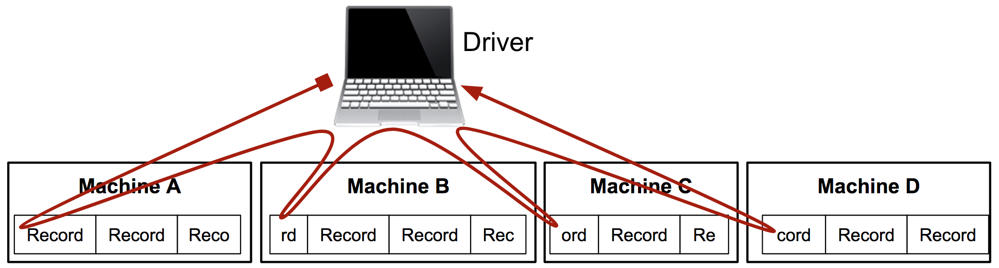
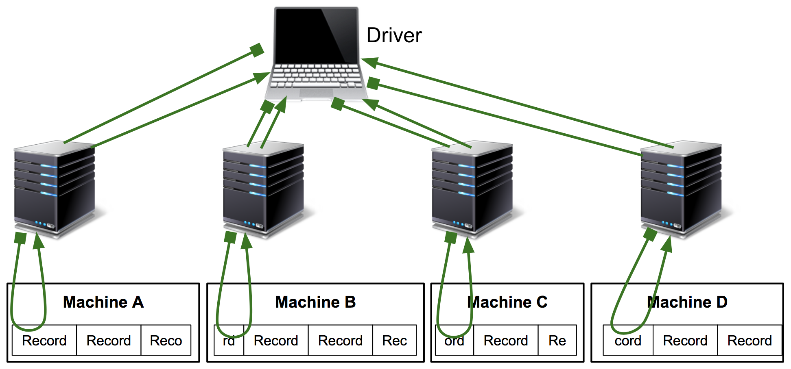

layout: true
name: title-slide
class: middle, title-slide

---
# Genomic Analysis in Scala

<br/>

Scala/Splash 2017

<br/>

October 22, 2017

Ryan Williams

---
layout: true
name: main-slides
class: main-slide

---
# Overview
- Intro
- Genomic applications
- General Scala libraries
- Design-pattern deep-dive
  - "fun" with implicits

.top-pad-2em[
**Slides: [hammerlab.org/splash-2017](http://hammerlab.org/splash-2017)**
]

--
.top-pad-2em[
Everything discussed in this talk open source / Apache 2.0
]

---
class: slide-padding-3em
# Hammer Lab

Mt. Sinai School of Medicine, NYC

.half-top-pad[
**Research**
]

- Personal Genome Vaccine pipeline / clinical trial
- Checkpoint blockade biomarkers, mutational signatures
- http://www.hammerlab.org/

.half-top-pad[
**Tools**
]

- Genome biofx using Spark + Scala
- Biofx workflows and tools in OCaml
- The usual suspects: python, R, …


.lab-photo[
&nbsp;
]

---
## coverage-depth

.covdepth-l[
&nbsp;
]

.covdepth-r[
&nbsp;
]

---
## coverage-depth

.covdepth-cdf[
&nbsp;
]

---
class: pad-h2-bottom
## spark-bam

Splitting genomic BAM files

--
.img-container.half-top-pad[

]

--

.img-container[

]

---
layout: false
class: divider-slide, middle
sub1: &nbsp;
sub2: &nbsp;
# Related Libraries

### {{sub1}}

#### {{sub2}}
--
sub1: Non-genomics-specific

--
sub2: Maybe you want to use them

---
layout: true
class: main-slide
---
## [magic-rdds](https://github.com/hammerlab/magic-rdds)
Collection-operations implemented for Spark RDDs

--
- scans

--
  - {left,right}

--
  - {elements, values of tuples}

--
- `.runLengthEncode`, group consecutive elements by predicate / `Ordering`

--
- `.reverse`

--
- reductions: `.maxByKey`, `.minByKey`

--
- sliding/windowed traversals

--
- `.size` - smart `count`

--
  - multiple counts in one job:
    ```
    val (count1, count2) = (rdd1, rdd2).size
    ```

--
  - smart partition-tracking: reuse counts for `UnionRDD`s

--
- zips

--
  - lazy partition-count, eager partition-number check

--
- `sameElements`, `equals`

--
- group/sample by key: first elems or reservoir-sampled

--
  - HyperGeometric distribution handling `Long`s: [hammerlab/math-utils](https://github.com/hammerlab/math-utils)

---
## [hammerlab/iterators](https://github.com/hammerlab/iterators)

--
- scans

--
- sliding/windowed traversals

--
- eager drops/takes

--
  - by number

--
  - while

--
  - until

--
- sorted/range zips

--
- `SimpleBufferedIterator`

--
  - iterator in terms of `_advance(): Option[T]`

--
  - `hasNext` lazily buffers/caches `head`

--
- etc.

---
class: line-height-code-11, pad-h2-bottom, slide-padding-3em
### [spark-commands](https://github.com/hammerlab/spark-commands/): command-line interfaces

--
.left-code-col.code-col[
### [args4j](http://args4j.kohsuke.org/)

```
class Opts {
  @args4j.Option(
    name = "--in-path",
    aliases = Array("-i"),
    handler = classOf[PathOptionHandler],
    usage = "Input path to read from"
  )
  var inPath: Option[Path] = None

  @args4j.Option(
    name = "--out-path",
    aliases = Array("-o"),
    handler = classOf[PathOptionHandler],
    usage = "Output path to write to"
  )
  var outPath: Option[Path] = None

  @args4j.Option(
    name = "--overwrite",
    aliases = Array("-f"),
    usage = "Whether to overwrite an existing output file"
  )
  var overwrite: Boolean = false
}
```
]

--
.right-code-col.code-col[
### [case-app](https://github.com/alexarchambault/case-app)

```
case class Opts(
  @Opt("-i")
  @Msg("Input path to read from")
  inPath: Option[Path] = None,

  @Opt("-o")
  @Msg("Output path to write to")
  outPath: Option[Path] = None,

  @Opt("-f")
  @Msg("Whether to overwrite an existing output file")
  overwrite: Boolean = false
)
```

]

--
.right-code-col.code-col[
- statically-checked/typed handlers
]

--
.right-code-col.col[
- implicit resolution
]

--
.right-code-col.col[
- inheritance vs. composition

]

--
.right-code-col.col[
- mutable vs. immutable

]

--
.right-code-col.col[
- case-app positional-arg support: [#58](https://github.com/alexarchambault/case-app/issues/58)

]

---
layout: false
class: divider-slide, middle
# Design Patterns
### Down the typelevel / implicit rabbit-hole

---
layout: true
template: main-slides

---
class: line-height-code-11, pad-h2-bottom
## [shapeless-utils](https://github.com/hammerlab/shapeless-utils)

--
### "recursive structural types"

--

.left-code-col.code-col[
Deep case-class hierarchy:

```scala
case class A(n: Int)
case class B(s: String)
case class C(a: A, b: B)
case class D(b: Boolean)
case class E(c: C, d: D, a: A, a2: A)
case class F(e: E)
```
]

--
.right-code-col.code-col[
Instances:

```scala
val a = A(123)
val b = B("abc")
val c = C(a, b)
val d = D(true)
val e = E(c, d, A(456), A(789))
val f = F(e)
```
]

--
.left-code-col.code-col[
Pull out fields by type and/or name:

```scala
f.find('c)      // f.e.c
f.findT[C]      // f.e.c
f.field[C]('c)  // f.e.c

f.field[A]('a2) // f.e.a2
f.field[B]('b)  // f.e.c.b
```
]

--
.right-code-col.code-col[
As evidence parameters:

```scala
def findAandB[T](t: T)(
  implicit
  findA: Find[T, A],
  findB: Find[T, B]
): (A, B) =
  (findA(t), findB(t))
```
]

---
name: mixing-implicits
class: line-height-code-11, pad-h2-bottom
## Nesting/Mixing implicit contexts

--
**Minimal boilerplate Spark CLI apps:**

--
- input `Path`

--
psMsg: 
- output `Path` {{psMsg}}

--
psMsg:  (or: just a `PrintStream`)

--
- `SparkContext`

--
- select `Broadcast` variables

--
- other argument-input objects


--
name: mixing2
.half-top-pad[
**How to make all of these things `implicit`ly available with minimal boilerplate?**
]

--
.clear-both.half-top-pad[
Ideally:
]

--
.l.col[
```
def app1() = {
  // call methods that want implicit \
  // input Path, SparkContext
}
```
]

--
.r.col[
```
def app2() = {
  // call methods that want implicit \
  // Path, SparkContext, PrintStream
}
```
]

---
template: mixing2

--
.l.code-col-40[
```
def run(
  implicit
  inPath: Path,
  printStream: PrintStream,
  sc: SparkContext,
  ranges: Broadcast[Ranges],
  …
): Unit = {
  // do thing
}
```
]

--
.r.code-col-56[
```
case class Context(
  inPath: Path,
  printStream: PrintStream,
  sc: SparkContext,
  ranges: Broadcast[Ranges],
  …
)
```
]

--
.r.code-col-56[
```
def run(`implicit ctx: Context`): Unit = {
  implicit val Context(
    `inPath, printStream, sc, ranges, …`
  ) = ctx
  // do thing
}
```
]

---
template: mixing-implicits
answer: 
How to make many `implicit`s available with minimal boilerplate? {{answer}}

--
answer: &nbsp; ≈ 🎂 🍰

--
```
trait HasSparkContext {
  implicit val sc: SparkContext = new SparkContext(…)
}
```
--
```
abstract class HasArgs(args: Array[String])
```
--
.l.col[
```
trait HasInputPath { self: Args ⇒
  implicit val inPath = Path(args(0))
}
```
]
--
.r.col[
```
trait HasOutputPath { self: Args ⇒
  `val` outPath = Path(args(1))
}
```
]
--
.clear-both.tenth-top-pad[
```
trait HasPrintStream extends HasOutputPath { self: Args ⇒
  implicit val printStream = new PrintStream(newOutputStream(outPath))
}
```
]

--
.l.col[
```
class MinimalApp(args: Array[String])
  extends HasArgs(args) 
  with HasInputPath 
  with HasPrintStream 
  with HasSparkContext
```
]

--
.r.col[
```
object Main {
  def main(args: Array[String]): Unit = 
    new MinimalApp(args) {
      // all the implicits!
    }
  }
}
```
]

---
class: line-height-code-11, pad-h2-bottom
## `{to,from}String`: invertible syntax

--
Miscellaneous tools output "reports":

```text
    466202931615 uncompressed positions
    156G compressed
    Compression ratio: 2.78
    1236499892 reads
    22489 false positives, 0 false negatives
```

--
.left-code-col.col.half-top-pad[
That comes from a data structure like:

```
case class Result(
  numPositions     : Long,
  compressedSize   : Bytes,
  compressionRatio : Double,
  numReads         : Long,
  numFalsePositives: Long,
  numFalseNegatives: Long
)
```
]

--
.right-code-col.col.half-top-pad[
or better yet:

```
case class Result(
  numPositions    : `NumPositions`,
  compressedSize  : `CompressedSize`,
  compressionRatio: `CompressionRatio`,
  numReads        : `NumReads`,
  `falseCounts     : FalseCounts`
)
```
]

--
toStringMsg: This is basically `toString`
.clear-both[
- {{toStringMsg}}
]

--
toStringMsg: This is ~~basically `toString`~~ the `Show` type-class

--
- twist: downstream tools want to parse these reports

--
- want to re-hydrate `Result` instances


--
```
implicit val _iso: Iso[FalseCounts] =
    iso"${'numFPs} false positives, ${'numFNs} false negatives" }
```

---
layout: false
class: divider-slide, middle
# Thanks!

--

